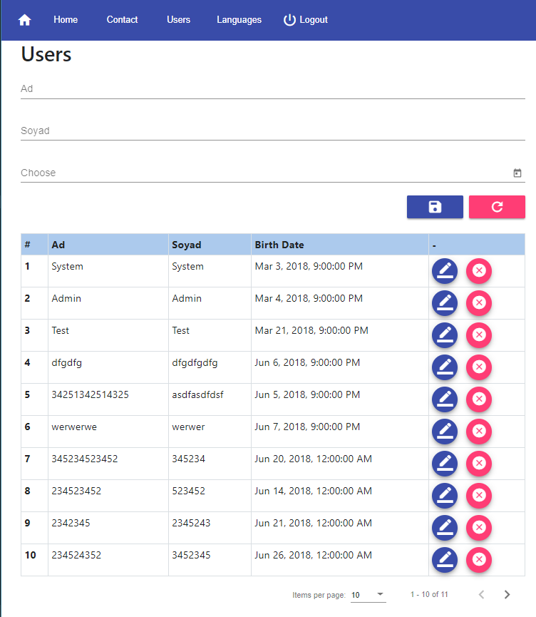

# Enterprise Angular Project

This project demonstrates how to build Enterprise Grade Angular Project.

## When we want to build Enterprise Project, We always need following pieces/functionalities 

- **User Interface and Design:** Bootstrap and Material Design give you easily create beautiful user interfaces, nowadays these two libraries is best practices

- **Web Icons:** We will need some useful icons on our project `Material Icons` is more common for Angular projects

- **Enterprise CSS Style:** All Enterprise project must have common enterprise style, you can add global CSS file for this purpose

- **Enterprise Utility Class:** All Enterprise project must have common utility methods, you can add global JavaScript/TypeScript file for this purpose.

- **JQuery:** Generally we don't use `JQuery` in Angular project but some developer likes JQuery, they believe JQuery more handy tool than others. "Just in case", you can add JQuery to your project.

- **Best Practice Angular Modules:** You can add best practice Angular modules to your project, for example, CommonModule, BrowserModule, HttpClientModule, FromsModule, AppRoutingModule, BrowserAnimationsModule, Mat**Module etc.

- **Browser Storage Module:** SPA applications need to use these browser storages `SessionStorage`, `LocalStorage` 

- **Configuration:** All Enterprise applications needs `Configuration` you can take configuration from js/json file like this `http://localhost:4200/assets/config.js`

```js
{
    Name: "core",
    AssetsUrl: "http://asset.mycompany.com",
    DefaultLanguage: "en",
    DefaultPagingSize: "15",
    DefaultBrowserTitle: "My Company",
    DefaultWebAPIAddress: "http://localhost:5001",
    SSOAddress: "http://sso.mycompany.com",    
    AllowedMaxExportSize: "2000",
    FileUploadPath: "wwwroot/files",
    //...
}
```

- **Authentication Interceptor:** All Enterprise applications must have `Authentication`, For this purpose, you can use "IdentityServer4". It supports `OpenID` and `OAuth2`, Then you can make `AuthenticationInterceptor` in Angular project in order to add the token to http header.

- **Authorization Guard:** A Common usage of Authorization guard is activating or deactivating authorized components

- **Unauthorized Component:** If user don't have an access permission to specific pages, you can redirect `unauthorized` page.

- **Internationalization:** By default, Angular uses the locale en-US, which is English as spoken in the United States of America, if you want to use another locale you can use `LOCALE_ID`

- **Application Loading Animation:** SPA applications always use loading animation for the first visit.

- **Page Load Animation:** Using page routing animation is a common approach for SPA. The purpose of animation  related UX  concerns

- **Menu:** All application must have `Menu` for navigation. 

- **Progress Bar:** According to UX Concerns, some server requests takes a long time, you can show what's going on the background with a progress bar.

- **Dialog Window:** We are building an interactive web application. Sometimes we want to ask/show some confirmation/information to the user, for example, delete confirmation.

- **Notifications:**  According to UX Concerns, Interactive applications always give feedback to the user. Best way to notify the user is using `toast` component.

- **Common Back-End and Front-End Objects** Angular applications can communicate with back-end using `JSON`. Enterprise application always uses common object between Back-end and Front-end because we want to know Request.IsSuccess, what is the resultType (information, Success, Warning, Error) is response have a message or exception? for this purpose, we want to use some common object between to side. For Example:

```js
export class ServiceResponse<T> {
    public IsSuccess: boolean;
    public ResultType: ResultType;
    public Message: string;
    public TotalCount: number;
    public Data: T;
}

export enum ResultType {
    Information = 1,
    Validation = 2,
    Success = 3,
    Warning = 4,
    Error = 5,
}
```

- **Interceptor for Server Side Messages:** Usually Enterprise application have Exception handling, we can intercept server-side messages/exceptions with Angular Interceptor.

- **CRUD Operation Service:** Best way to prevent code repetition is making a common class. Sometimes we always repeat same code on the same application layer. For example database layer always have CRUD (Create, Read, Update, Delete) operations, But Enterprise applications generally use common object/classes for this. We can make Angular service that includes these methods: post, get, put, delete

- **Translate Service:** If we want to build multilingual application we must create translator service.

- **Delete Confirmation:** If we want to make enterprise application, we usually show data with data grid or data table, then we have to implement delete confirmation on table or grid.

- **ToolTip:** Sometimes we use Icons on the user interface, in enterprise application we have to show icon meaning with tooltip.

- **Data Table or Data Grid:** If we want to make enterprise application, we usually show data with data grid or data table. optional: sorting data with table header, exporting functionality

- **Database Pagination:** Sometimes we have a lot of record on the database table, we don't show all record on the user interface, it's effect application performance and usability of the application. Pagination is the best way to show data.

- **Dashboard:** SPA applications always use Dashboard, you can add DashBoard to your project  the following tutorial [https://github.com/creativetimofficial/material-dashboard?utm_campaign=explore-email&utm_medium=email&utm_source=newsletter&utm_term=daily](https://github.com/creativetimofficial/material-dashboard?utm_campaign=explore-email&utm_medium=email&utm_source=newsletter&utm_term=daily)

You can use the following tutorial for making Enterprise Angular Project [http://atilla.tanrikulu.biz/Making-Enterprise-Angular-Project-step-by-step/](http://atilla.tanrikulu.biz/Making-Enterprise-Angular-Project-step-by-step/)



